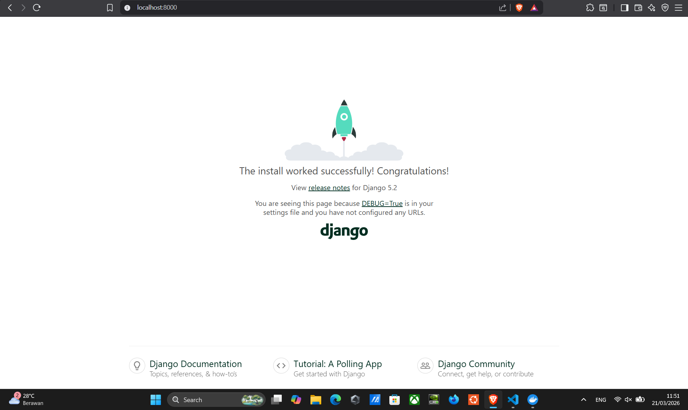
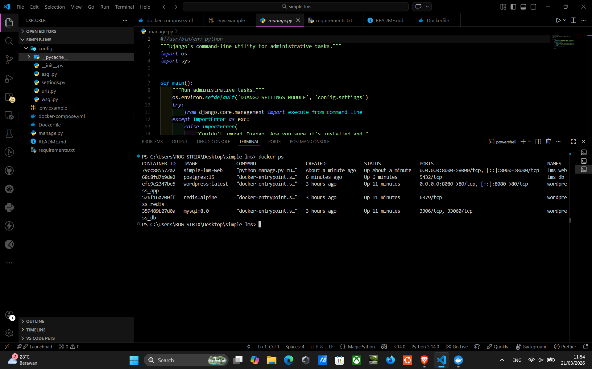

# Simple LMS - Docker & Django Foundation

## 📌 Overview

Project ini merupakan setup awal (foundation) untuk aplikasi Simple LMS menggunakan Django dengan PostgreSQL sebagai database yang dijalankan menggunakan Docker Compose.

---

## 🧱 Tech Stack

- Django
- PostgreSQL 15
- Docker & Docker Compose
- Python 3.11

---

## 📁 Struktur Folder

```
simple-lms/
├── docker-compose.yml
├── Dockerfile
├── .env.example
├── requirements.txt
├── manage.py
├── config/
│   ├── settings.py
│   ├── urls.py
│   └── wsgi.py
└── README.md
```

---

## ⚙️ Docker Configuration

### Services:

- **web** → Django application
- **db** → PostgreSQL database

### docker-compose.yml

```yaml
services:
  db:
    image: postgres:15
    container_name: lms_db
    restart: always
    environment:
      POSTGRES_DB: lms
      POSTGRES_USER: lmsuser
      POSTGRES_PASSWORD: lmspass
    volumes:
      - postgres_data:/var/lib/postgresql/data

  web:
    build: .
    container_name: lms_web
    command: python manage.py runserver 0.0.0.0:8000
    volumes:
      - .:/app
    ports:
      - "8000:8000"
    depends_on:
      - db
    environment:
      DB_NAME: lms
      DB_USER: lmsuser
      DB_PASSWORD: lmspass
      DB_HOST: db
      DB_PORT: 5432

volumes:
  postgres_data:
```

---

## 🚀 Cara Menjalankan

### 1. Build & run container

```bash
docker compose up -d
```

### 2. Jalankan migration

```bash
docker compose exec web python manage.py migrate
```

---

## 🌐 Akses Aplikasi

Buka di browser:

```
http://localhost:8000
```

---

## 🧪 Testing

- Django berhasil dijalankan ✔️
- PostgreSQL terkoneksi ✔️
- Migration berhasil ✔️

---

## 🔐 Environment Variables

File `.env.example`:

```env
DB_NAME=lms
DB_USER=lmsuser
DB_PASSWORD=lmspass
DB_HOST=db
DB_PORT=5432
```

---

## 📦 Database Configuration

Django menggunakan PostgreSQL dengan konfigurasi berikut:

```python
import os

DATABASES = {
    'default': {
        'ENGINE': 'django.db.backends.postgresql',
        'NAME': os.environ.get('DB_NAME'),
        'USER': os.environ.get('DB_USER'),
        'PASSWORD': os.environ.get('DB_PASSWORD'),
        'HOST': os.environ.get('DB_HOST'),
        'PORT': os.environ.get('DB_PORT'),
    }
}
```

---

## 📸 Screenshots

### Django Running



### Docker Containers



---

## 🛠️ Troubleshooting

- Cek logs:

```bash
docker compose logs
```

- Jika database tidak connect:
  - Pastikan environment variables benar

- Jika tidak bisa akses web:
  - Pastikan port `8000:8000` terbuka

---

## 🎯 Kesimpulan

Project ini berhasil membangun environment development Django menggunakan Docker dengan PostgreSQL sebagai database, serta memastikan aplikasi berjalan dengan baik di localhost.
